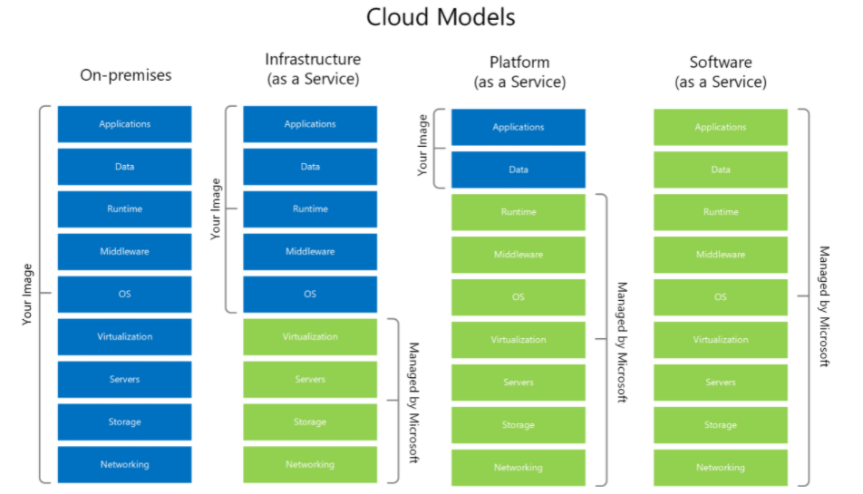

## Hosting PostgreSQL on Azure - benefits and options

- 01 [Introduction to PostgreSQL on Azure]
- 02 [Introduction to Azure Resource Management](https://github.com/microsoft/azure_pg_dev_workshop/blob/main/02_IntroToPostgreSQL/02_02_Introduction_to_Azure_resource_mgmt.md)
- 03 [Introduction to Azure Database for PostgreSQL](https://github.com/microsoft/azure_pg_dev_workshop/blob/main/02_IntroToPostgreSQL/02_03_Introduction_to_Azure_PaaS_PostgreSQL.md)
- 04 [Migration](https://github.com/microsoft/azure_pg_dev_workshop/blob/main/02_IntroToPostgreSQL/02_04_Migration.md)
- 05 [Summary] (https://github.com/microsoft/azure_pg_dev_workshop/blob/main/02_IntroToPostgreSQL/02_05_Summary.md)

Now that the benefits of PostgreSQL and a few common deployment models have been presented, this section explains approaches to hosting PostgreSQL specifically on Microsoft Azure and the many advantages of the Microsoft Azure platform.

### Advantages of choosing Azure

Millions of customers worldwide trust the Azure platform, and there are over 90,000 Cloud Solution Providers (CSPs) partnered with Microsoft to add extra benefits and services to the Azure platform. By leveraging Azure, organizations can easily modernize their applications, expedite application development, and adapt application requirements to meet the demands of their users.

By offering solutions on Azure, ISVs can access one of the largest B2B markets in the world. Through the [Azure Partner Builder's Program](https://partner.microsoft.com/marketing/azure-isv-technology-partners), Microsoft assists ISVs with the tools and platform to offer their solutions for customers to evaluate, purchase, and deploy with just a few clicks of the mouse.

Microsoft's development suite includes such tools as the various [Visual Studio](https://visualstudio.microsoft.com/) products, [Azure DevOps](https://dev.azure.com/), [GitHub](https://github.com/), and low-code [Power Apps](https://powerapps.microsoft.com/). All of these contribute to Azure's success and growth through their tight integrations with the Azure platform. Organizations that adopt modern tools are 65% more innovative, according to a [2020 McKinsey & Company report.](https://azure.microsoft.com/mediahandler/files/resourcefiles/developer-velocity-how-software-excellence-fuels-business-performance/Developer-Velocity-How-software-excellence-fuels-business-performance-v4.pdf)

To facilitate developers' adoption of Azure, Microsoft offers a [free subscription](https://azure.microsoft.com/free/search/) with $200 credit, applicable for thirty days; year-long access to free quotas for popular services, including Azure Database for PostgreSQL Flexible Server; and access to always free Azure service tiers. Create an Azure free account and get access to [750 hours of Azure Database for PostgreSQL Flexible Server on a Burstable B1MS instance with 32GB storage for free](https://learn.microsoft.com/azure/postgresql/flexible-server/how-to-deploy-on-azure-free-account).

### PostgreSQL on Azure hosting options

The concepts of Infrastructure as a Service (IaaS) and Platform as a Service (PaaS) typically define the public cloud provider and the enterprise customer resource responsibilities. Both approaches are common ways to host PostgreSQL on Azure.

In addition to the below information, reference [Choose the right PostgreSQL server option in Azure](https://learn.microsoft.com/azure/postgresql/flexible-server/overview-postgres-choose-server-options) for the latest information. This document outlines other considerations such as Total Cost of Ownership, Billing, Administration and migration time.

#### IaaS (VMs)

In the IaaS model, organizations deploy PostgreSQL on Azure Virtual Machines. This model allows the customer to choose when to patch the VM OS, the PostgreSQL engine, and install other software such as antivirus utilities when required. Microsoft is responsible for the underlying VM hardware that constitutes the Azure infrastructure. Customers are responsible for all other maintenance.

Because IaaS PostgreSQL hosting gives greater control over the PostgreSQL database engine and the OS, many organizations choose to lift and shift on-premises solutions while minimizing capital expenditure.

#### IaaS (Containers)

Although VMs are typically considered the primary IaaS approach, containerizing PostgreSQL instances and applications can also be included in this approach. Modernizing applications allows for more opportunities for deployment and management with Kubernetes and container hosting environments coming into the picture. Azure provides Azure Kubernetes Service (AKS) and, as explored below, several other PaaS-based approaches to hosting PostgreSQL and application containers.

#### PaaS (DBaaS)

In the PaaS model, organizations deploy a fully managed PostgreSQL environment on Azure. Unlike IaaS, they cede control over patching the PostgreSQL engine and OS to the Azure platform, and Azure automates many administrative tasks, like providing high availability, backups, and protecting data.

Like IaaS, customers are still responsible for managing query performance, database access, and database objects, such as indexes. PaaS is suitable for applications where the PostgreSQL configuration exposed by Azure is sufficient, and access to the OS and filesystem is unnecessary.

The Azure DBaaS PostgreSQL offering is [Azure Database for PostgreSQL Flexible Server](https://azure.microsoft.com/services/PostgreSQL/#features). It supports many of the common administration tools and programming languages.

The service generally provides more flexibility and server configuration customizations based on user requirements. The flexible server architecture allows users to collocate the database engine with the client tier for lower latency and choose high availability within a single availability zone and across multiple availability zones. Flexible servers also provide better cost optimization controls with the ability to stop/start the server and a burstable compute tier ideal for workloads that do not need full compute capacity continuously.

The Azure Database for PostgreSQL Flexible Server is available in most Azure regions, however, when looking for a specific set of supported features, reference the [latest documentation](https://learn.microsoft.com/azure/postgresql/flexible-server/overview#azure-regions).

Within an Azure Database for PostgreSQL Flexible Server, it is possible to create one or multiple databases. In some cases, it might be appropriate to create a single database per server to utilize all the available resources or create multiple databases to share the resources. The pricing is structured per server, based on the configuration of pricing tier, vCores, and storage (GB). For more information, see [Compute and Storage options](https://learn.microsoft.com/azure/postgresql/flexible-server/concepts-compute-storage).

#### PaaS (Containers)

In addition to the IaaS and PaaS options mentioned above, it is possible to choose to host container-based instances inside PaaS-based services such as Azure Container Instances and Azure App Services.

#### Video reference

For a video comparison of cloud hosting models, please refer to [Microsoft Learn.](https://learn.microsoft.com/learn/modules/cmu-cloud-computing-overview/4-building-blocks)
